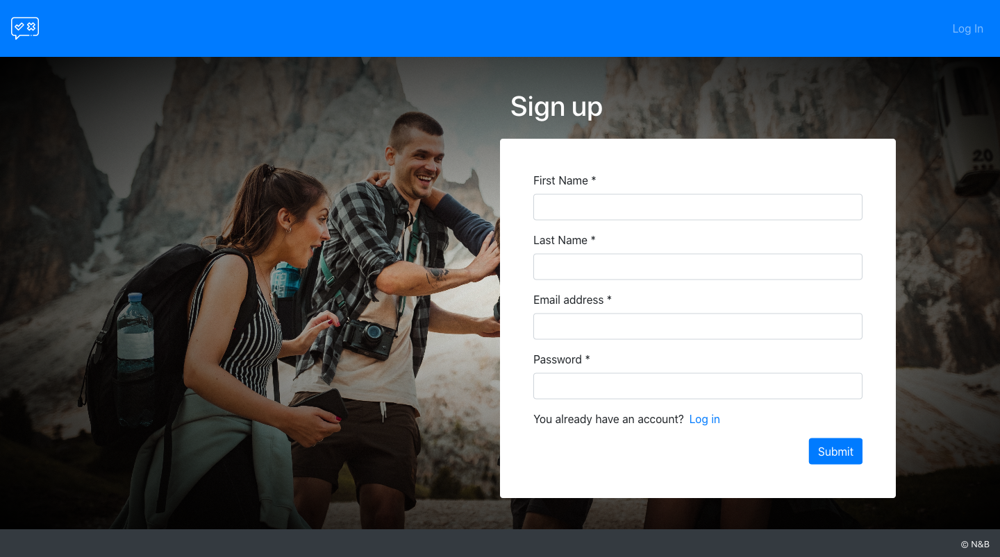
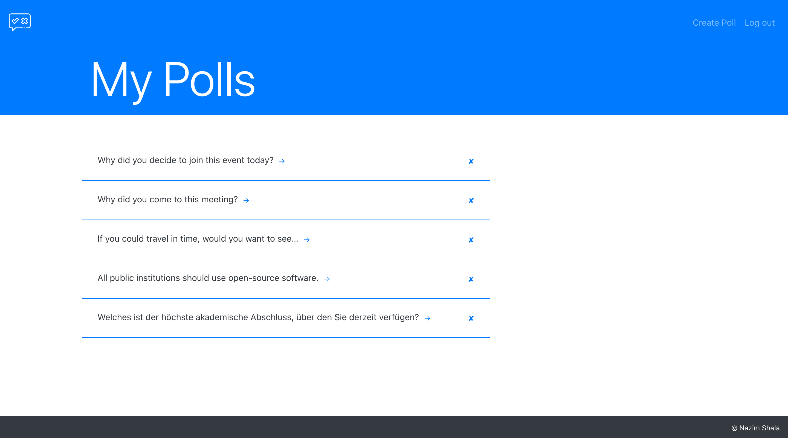
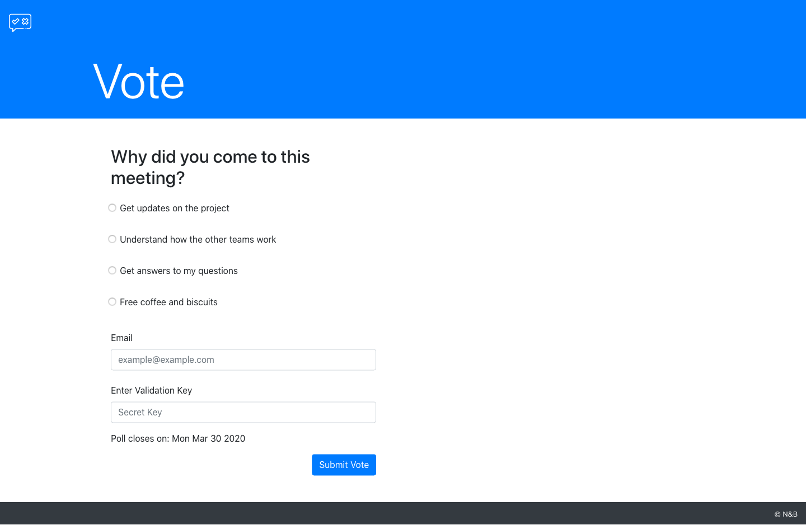
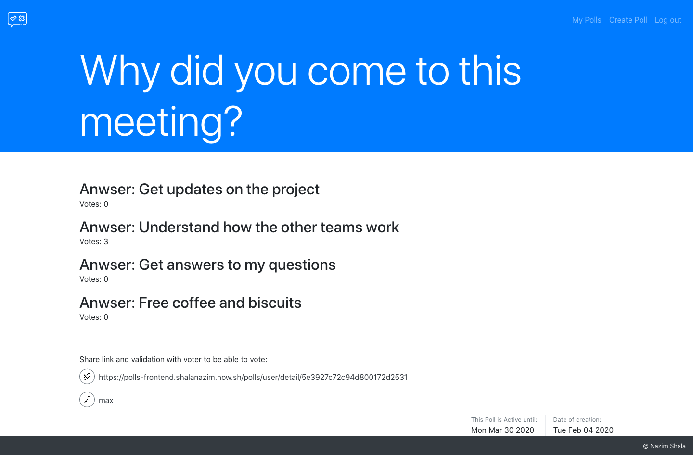

# Poll App

[Checkout live demo](https://polls-frontend.shalanazim.now.sh/login)

  
For login credentials click here

  <pre>
  <code>
    Email address: max@mustermann.org
    Password: mustermann
  </code>
  </pre>

## Setup

Make sure you have node isntalled, then run `npm install`

## Run locally

To run the project locally run `npm start`
You can then open the project on [http://localhost:3000](http://localhost:3000) in the browser.

## Build

To build the project run `npm run build`

Builds the app for production to the `build` folder.

## Polls app preview

